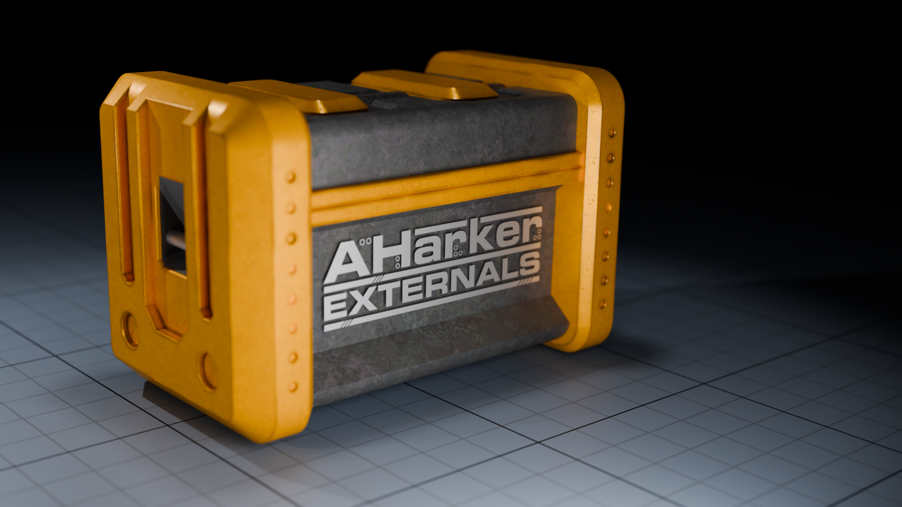

AHarker Externals
=================



A Set of 80+ Externals for a variety of tasks in Cycling 74's Max by Alex Harker

Overview:

* general purpose scaling for Max and MSP
* efficient partitioned + non-partitioned convolution
* comprehensive descriptor analysis (realtime + non-realtime)
* enhanced audio multi-threading / dynamic patch loading
* efficient buffer playback and storage
* high quality random number generators for Max and MSP
* sample accurate voice management and more
* thread debugging and switching
* utility objects
* SIMD versions of 35 basic MSP objects

AHarker Externals:
- support Mac and Windows in 64bit, including support for Apple Silicon (M1) processors.
- are licensed under the 3-clause BSD license.

Enjoy!

Alex

Package Releases / Binaries
---------

- At this time alpha releases are available via GitHub **[releases](https://github.com/AlexHarker/AHarker_Externals/releases)**. 
- Until official release some objects interfaces may change.
- Please note that the behaviour of *descriptors~ / descriptorsrt~* may differ from earlier versions. 
- Please report any issues with the issues page on GitHub. 

Building using Provided Projects
---------

This repositiory uses submodules.
Make sure these are correctly cloned/updated before trying to build.
Should you wish to build the externals yourself you will require the following:

**Mac:**
1. Xcode

*Notes*

* AVX / SSE support can also be toggled in projects/ah_projects_config/config_mac.xcconfig (for old machines, or Rosetta 2 support).

**Windows:**
1. Visual Studio
2. OneMKL - https://www.intel.com/content/www/us/en/developer/tools/oneapi/onemkl-download.html

Building using CMake
---------

Alternatively you can generate projects and build via cmake by following the commands below (requires cmake in addition to the above, and python on windows for the MKL installation):

**Mac:**

```sh
mkdir build
cd build
cmake .. -GXcode
cmake --build . --config Release
```

**Windows:**

In this case OneMKL is installed via a python script (rather than the installer above)

```sh
mkdir build (or New-Item -ItemType Directory -Path build) # use the latter if in  Powershell
python source/scripts/install_mkl.py # once to install mkl
cd build
cmake ..
cmake --build . --config Release
```
With thanks to shakfu (https://github.com/shakfu) for providing cmake support

Contact
---------

* ajharker@gmail.com 
* http://www.alexanderjharker.co.uk/
			
